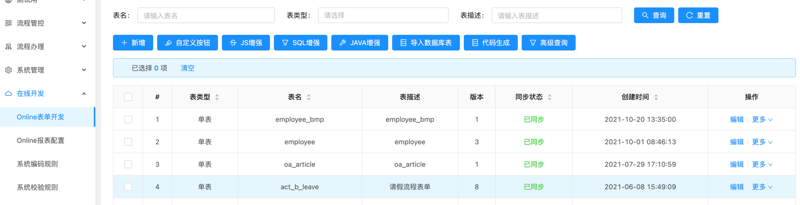
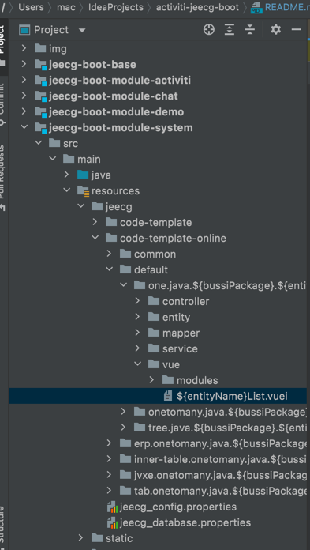
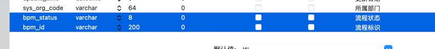
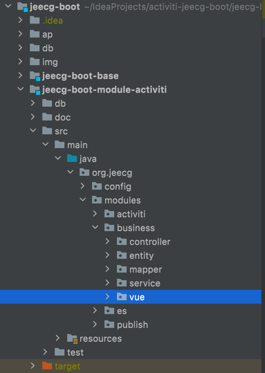
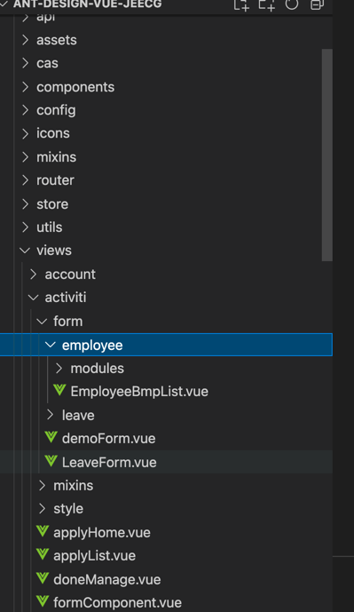
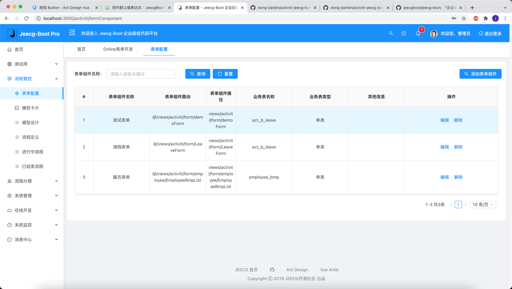

## 目标
*零代码 + 全配置 = ❤️工作流*

## 复杂业务流程

1. 企业级复杂度的业务表单生成器
    JeecgBoot online代码生成器非常强大：支持单表、一对一、一对多、树模型生成，生成的代码包括前台和后台，生成后直接使用，无需修改
    具体配置请参见 JeecgBoot 开发文档： http://doc.jeecg.com
    本项目对JeecgBoot online代码生成器的模板进行了改造，主要修改了前端项目vue部分，以便生成的代码无缝的对接到工作流中。
    业务表单中额外需要两个字段：bpm_status 通过这个标识在模板中区分工作流表单和普通表单。
                            bpm_id 工作流标识，用于标识一个工作流实例包含多条业务数据。
online代码生成器，生成代码  

修改代码生成器模板   

业务表单需特别的字段  

2. 业务表单和工作流桥接，用于对接工作流和业务表单。根据表单生成器生成代码的路径来配置表单的路由，路径，数据库主表名称和子表名称。
配置路径需参照代码生成的物理位置,以及vue代码拷贝到前端项目的位置。  

配置表单信息  

3. 高可用工作流，实现全配置。流程判断灵活，主表记录的所有字段值都可作为条件判断依据。
工作流和业务表单是低耦合的。工作流对表单样式理论上是没有限制的，可以是单页，多tab子页，树状页，等等。
工作流对表单的数据的复杂度不做限制，原则一张主表n张子表的结构，表中的记录条数不做限制
通过灵活的权限控制，对数据的横向和纵向切割，适用不同工作流节点做不同的业务。
指派人界面可配置，抽取出常用的指派场景  

流程配置   

节点配置

表单对接

流程办理

## 简单业务流程

1. 流程的所有节点显示一个业务表单  **完成**
2. 业务表单对应一张数据库业务表的一条记录 **完成**
3. 流程分支条件来源于这条记录的所有字段值 **完成**
4. 业务表单可拖拽生成 *开发中*
5. 业务流程集成页面 *开发中*

