## 目标
### **零代码 全配置 工作流**

## 简单业务流程

1. 流程的所有节点显示一个业务表单  **完成**
2. 业务表单对应一张数据库业务表的一条记录 **完成**
3. 流程分支条件来源于这条记录的所有字段值 **完成**
4. 业务表单可拖拽生成 *开发中*
5. 业务流程集成页面 *开发中*

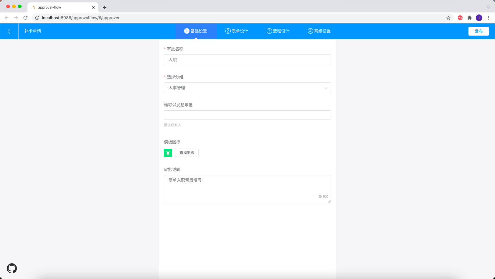

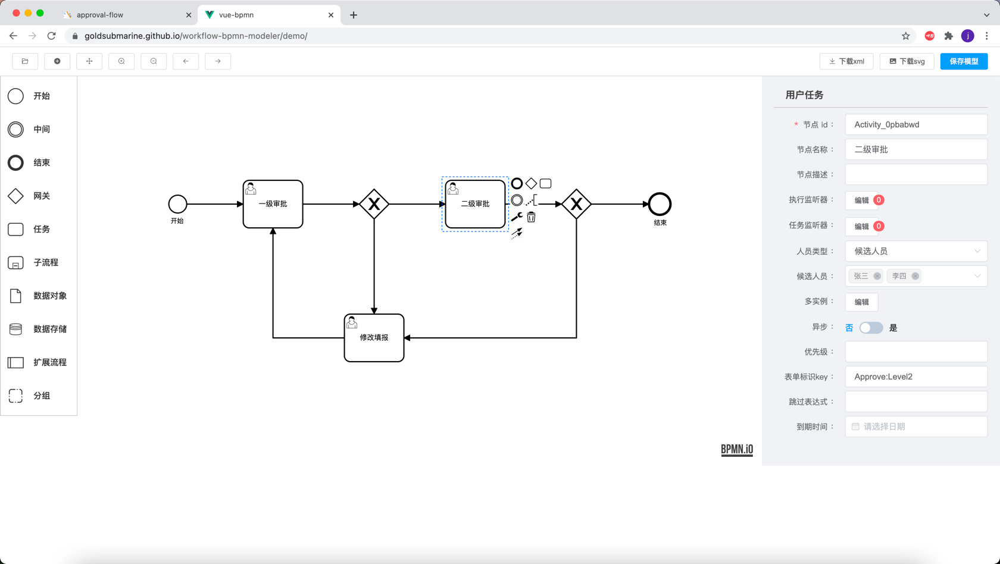
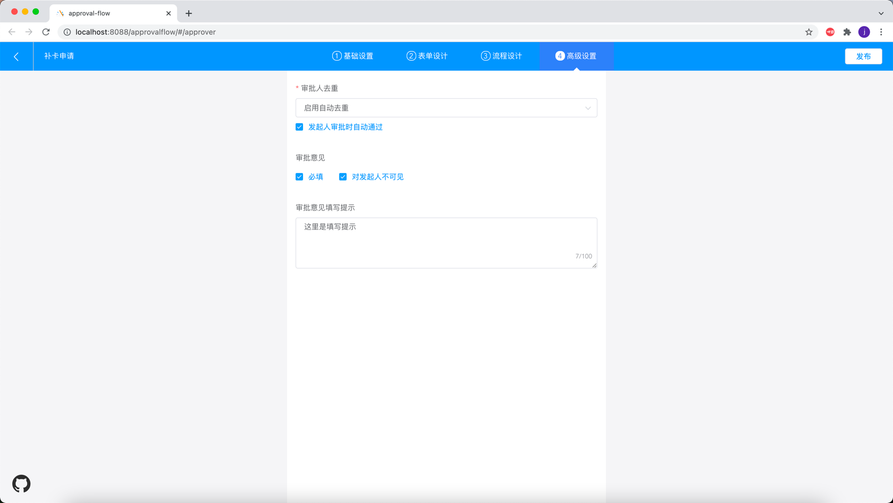

## 复杂业务流程

1. 流程的所有节点，可以定制显示不同业务表单，流程本身也可以选择表单作为基础表单 *开发中*
2. 业务表单对应的数据库表数量不做限制，一张主表n张子表的结构，表中的记录条数不做限制 *开发中*
3. 流程分支条件来源于主表记录的所有字段值 **完成**
4. 业务表单可在线配置生成 **完成**

流程配置
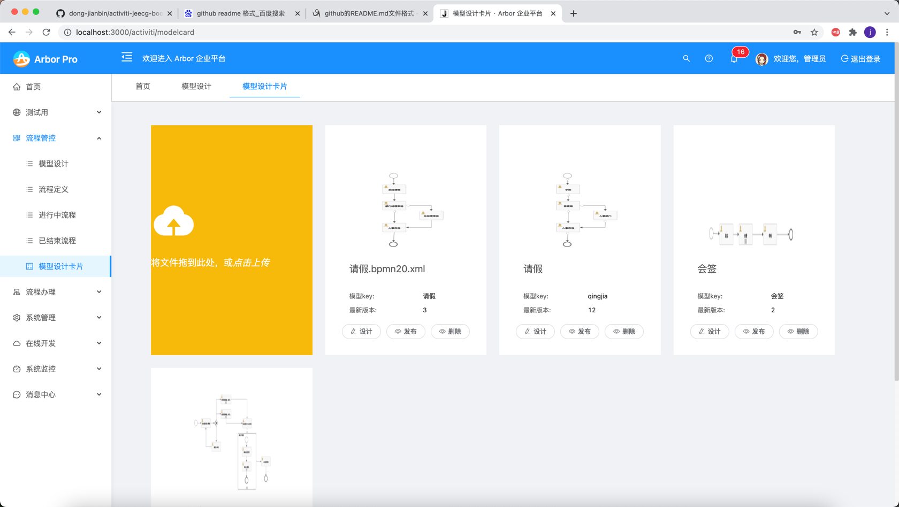
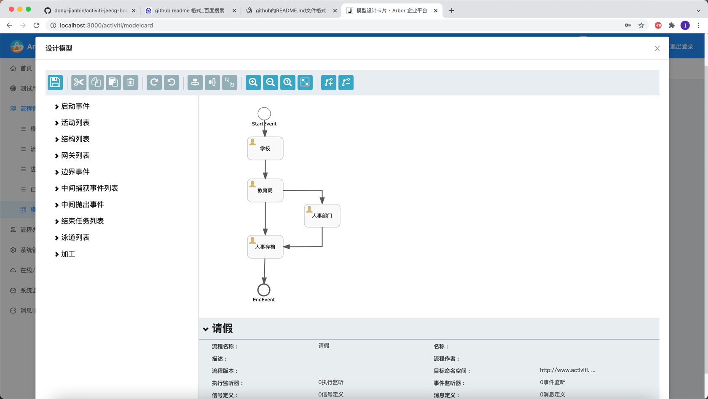
节点配置
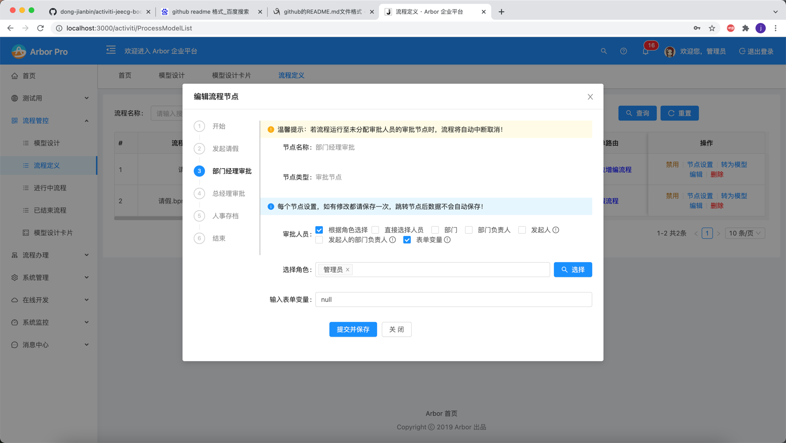
表单对接

流程办理
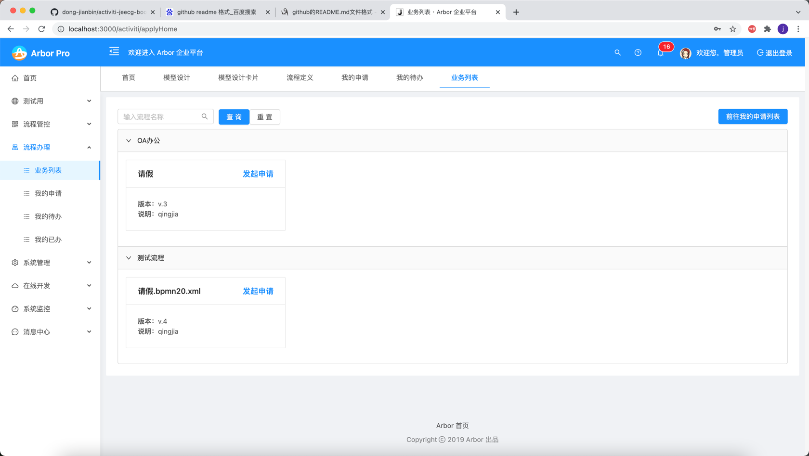
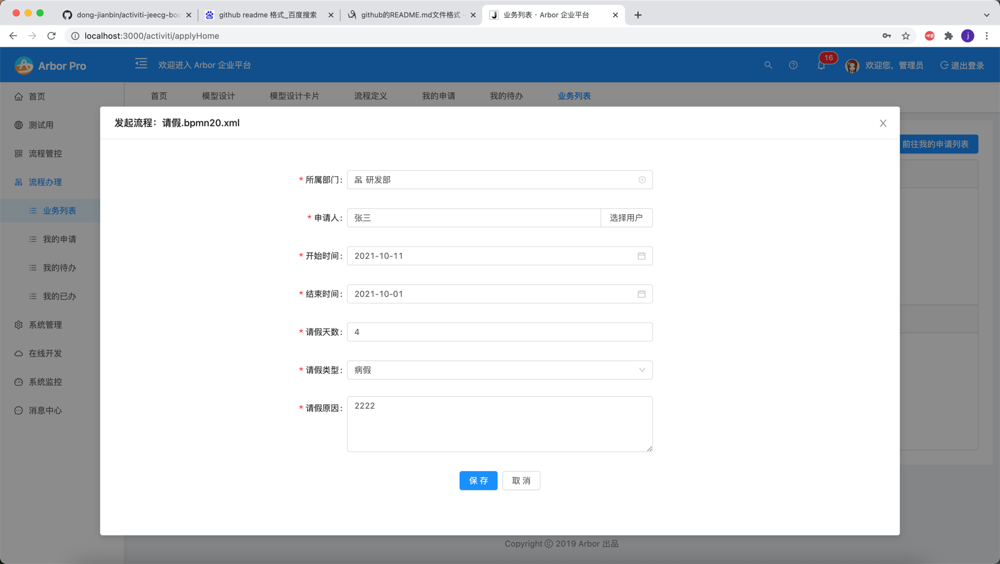
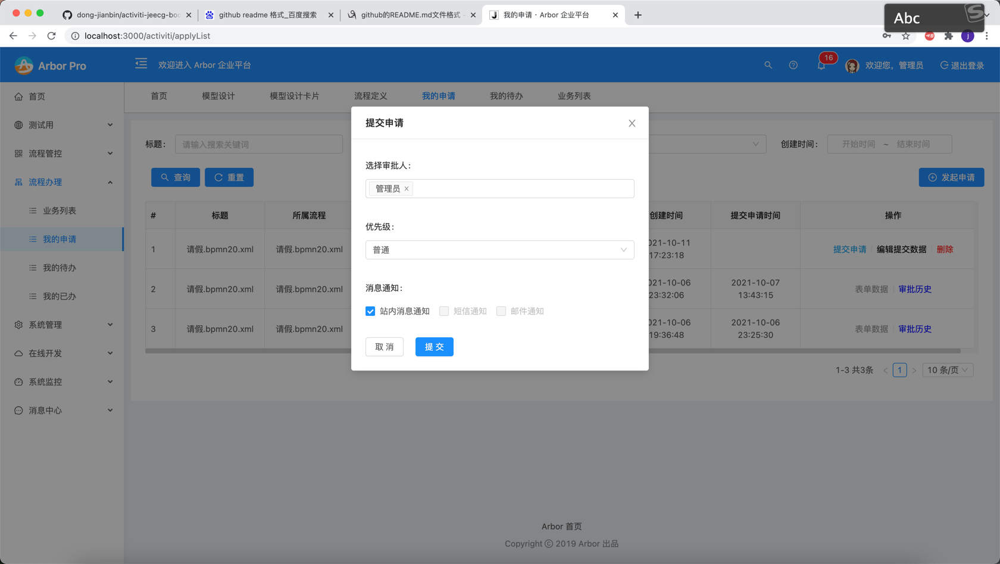
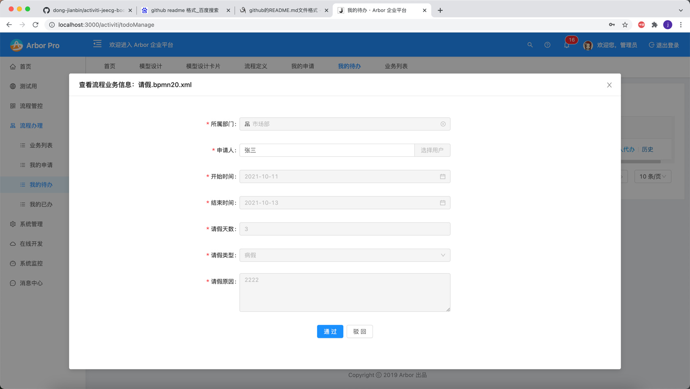
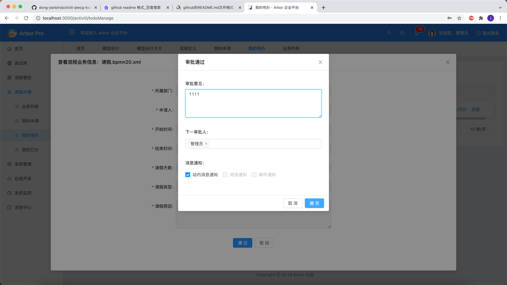

表单配置

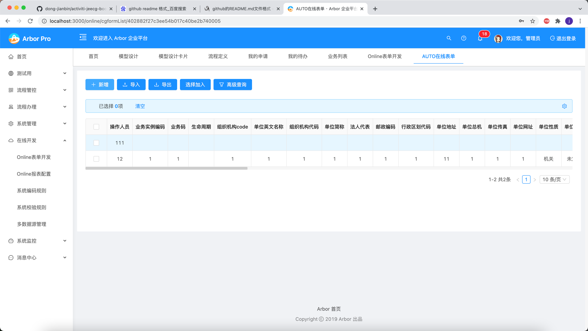
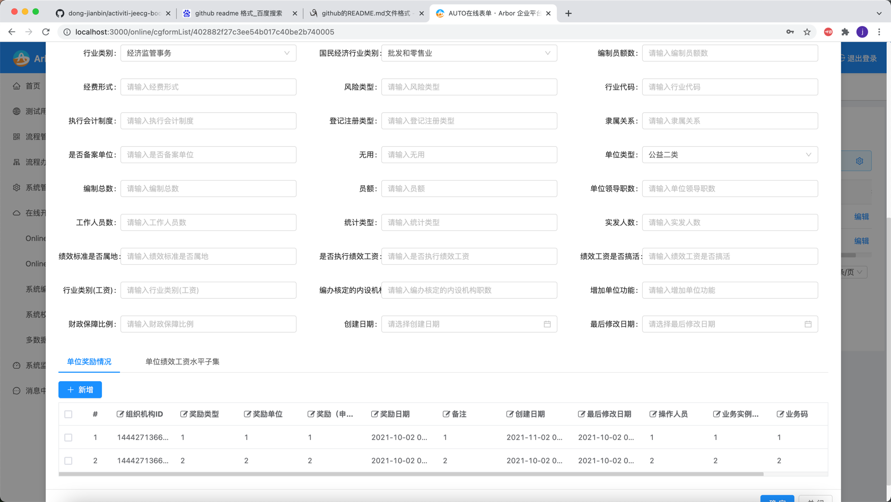

