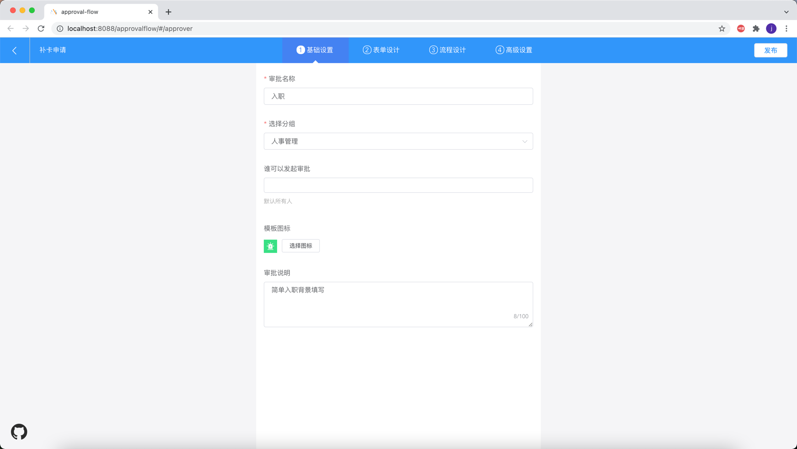
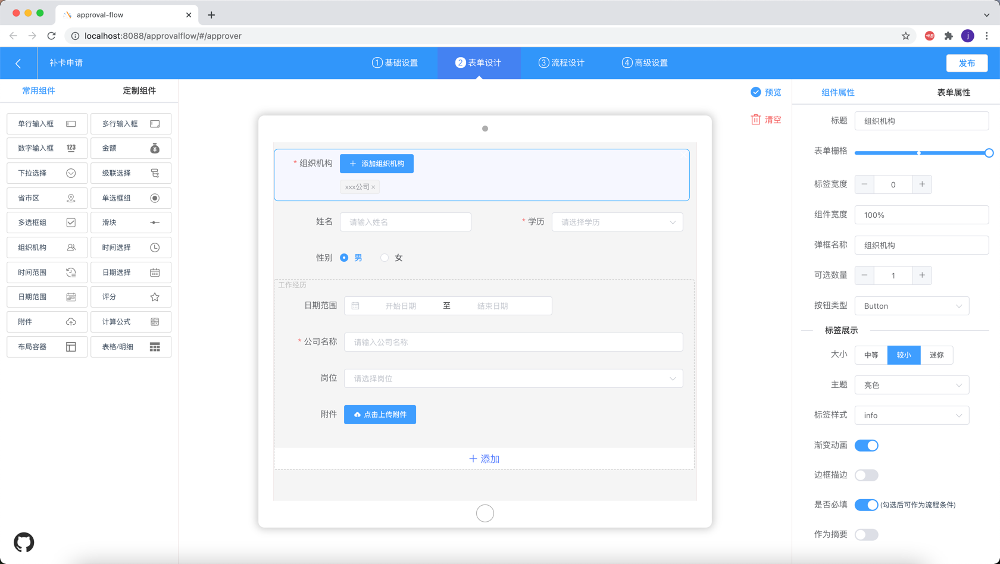
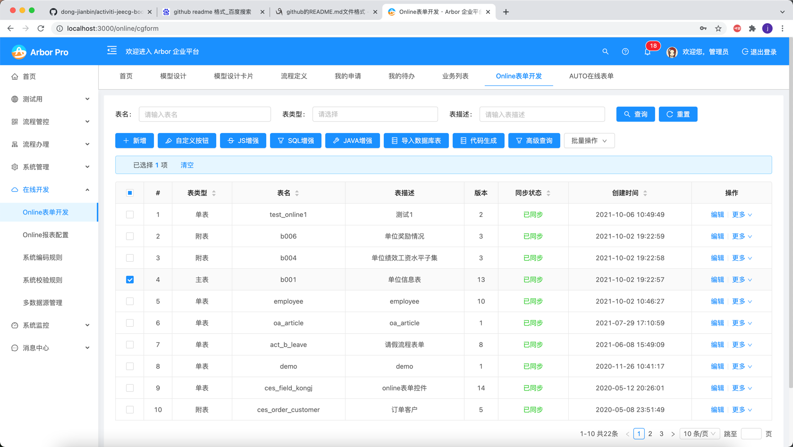

## 简单业务流程

1. 流程的所有节点显示一个业务表单
2. 业务表单对应一张数据库表的一条记录
3. 流程分支条件来源于这条记录的所有字段值
4. 业务表单可拖拽生成
5. 业务流程集成页面

## 复杂业务流程

1. 流程的所有节点，可以定制显示不同业务表单，流程本身也可以选择表单作为基础表单
2. 业务表单对应的数据库表数量不做限制，一张主表n张子表的结构，表中的记录条数不做限制
3. 流程分支条件来源于主表记录的所有字段值
4. 业务表单可在线配置生成

